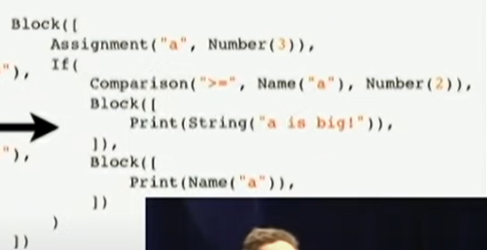

# Fr2Py-Interpreter

French pseudo-code to Python interpreter. The language is intended to be used by french-speaking children or teenagers and aims to be easy to understand for non-programmers.

## The language

The language that this Interpreter interprets is based on French vocabulary and looks like so :

<!-- incomplete : insert code example -->

```
x = demande("Quel est ton chiffre favori")
si x < 3
alors
    affiche(x, "est plus petit que 3")
sinon
    affiche(x, "is greater than 3")
fin-si
maVariable1 = 2 + 3 * 4 # ceci est un commentaire, this is a comment
maVariable2 = maVariable1 >= 17
maVariable3 = 3 / 2 #maVariable3 = 1.5
maVariable4 = "du texte..." + " some text"

fonction maFonction1(x, y, z)
    retourne x + y + z
```

Main characteristics :

-   end-of-line matters. There can be only one statement per line and a statement must fit in a line.
-   indentation doesn't matter. Use it to make the code easier to read.
-   `demande` is the function to ask input from the console (like `input` in Python).
-   `affiche` is the function to print to the console. Its parameters are printed with a single whitespace in between them and a newline is added at the end.
-   `if` statements use the keyword `si` and don't require parenthesis. The code between `alors` and `sinon` is executed if the condition is true. The code between `sinon` and `fin-si` matches the `else` clause of most languages.
-   functions are declared using the `fonction` keyword, followed by the function's name, parameters in between parenthesis, statements (0, 1 or many) and the `return` statement.
-   function parameters are assigned by position and their number on function calls must match the function declaration.
-   functions can only have one `return` statement (the last statement of the function). That statement starts with the keyword `retourne` and the expression or variable to return. Void functions can use the `retourne` keyword followed by a newline.
-   variable types are dynamic (no need to specify the type on variable creation and the type can change during the variable's life). Variable types include : `texte` (strings), `nombre` (numbers, int or float) and `vrai-ou-faux` (boolean).
-   variable and function names can contain letters, numbers and underscores, but cannot start with a number.
-   comments start with a `#` symbol and end at the end of the line.
-   the existing mathematical operators are : `+ - * / ^`. The character `^` is for exponents.
-   the existing logical operators are : `< > <= >= = et ou pas pas=`. The word `et` corresponds to `and`, `ou` to `or`, `pas` to `not` and `pas=` to `!=`. The character `=`, when used between `si` and `alors`, represents equality (`==` in most languages), while it is used for assignment everywhere else.

Possible future characteristics :

-   loop statements (`for`, `while`, etc.)
-   data structures (lists/arrays, dictonaries, etc.)
-   other assignment-like operators including : `+= -= /= *= `
-   inline if statement : `x = 3 si y < 2 sinon 4` or `x = si y < 2 alors 3 sinon 4`
-   `vrai` and `faux`, the `true` and `false` keywords
-   classes or structs
-   file i/o
-   multi-line comments

Keywords :

-   demande
-   affiche
-   si
-   alors
-   sinon
-   fin-si
-   fonction
-   retourne
-   et
-   ou
-   pas
-   pas=

---

## The Interpreter's parts

### Lexer / Tokenizer

The lexer takes the program as a string and transforms it into a list of tokens.

### Parser

The parser uses the list of tokens to build the structure of the program, by creating an Abstract Syntax Tree (AST).

The AST basically is a group of nested objects representing the structure of the program. The following screenshot is from the Youtube video [So you want to write an interpreter?](https://www.youtube.com/watch?v=LCslqgM48D4).



### Compiler <!-- incomplete -->

The compiler converts the AST into bytecode. I decided to skip this step and to interpret the AST directly. It is less efficient, but easier to implement.

### Object model <!-- incomplete -->

The object model defines what is possible in the language. For example, you could decide to have only integer numbers, no floating point numbers. Or you could consider those the same thing, two possibilities in a "number" object. Or you could have "integer" and "floating point" objects, with different behaviours and constraints.

### Interpreter

The interpreter usually runs the bytecode, but because I chose to skip the Compilation part, I have something closer to an AST-walker, meaning that the nodes in the AST are executed <!-- incomplete : or execute themselves directly? --> directly. This is simpler to implement, even though it is generally slower.

---

## Why Python?

Simply because I wanted to make the project easier, even though I know it won't run very fast.
